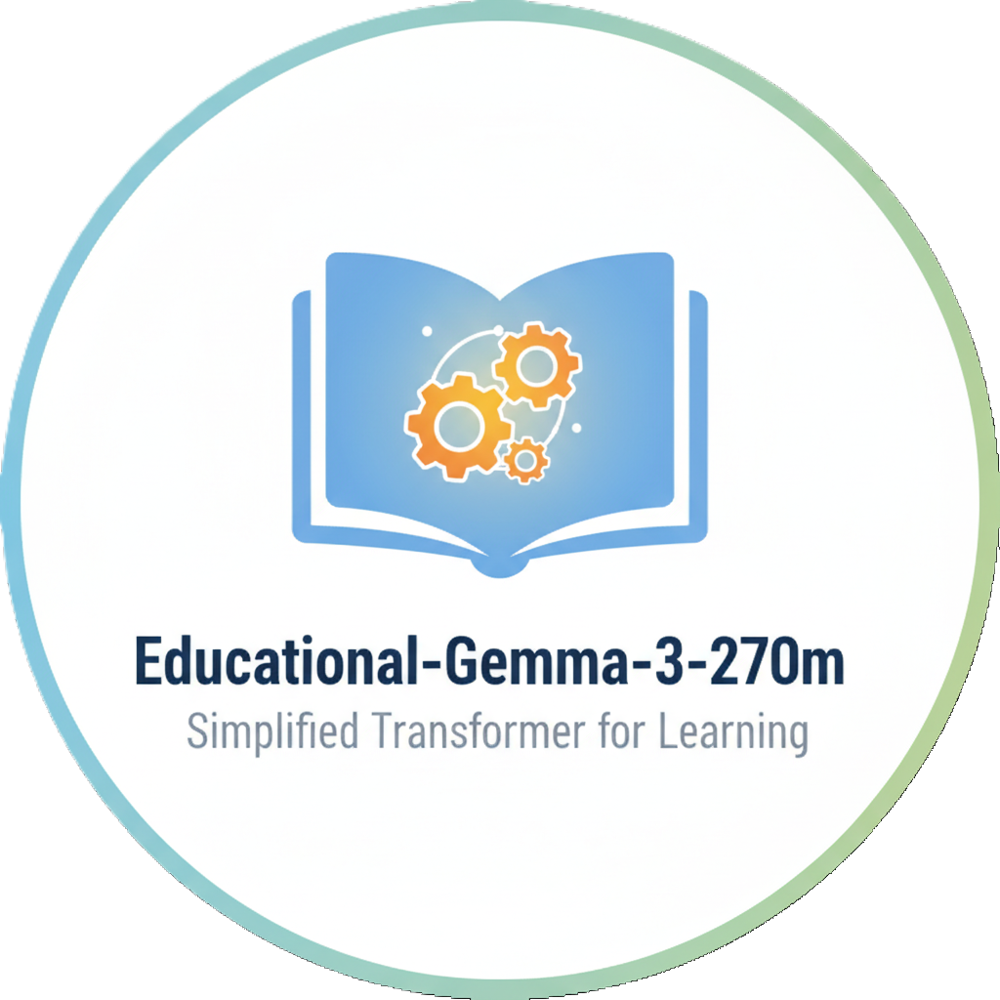

# Educational Gemma 3 (270M)

[](LICENSE) [](https://www.python.org/) [](https://github.com/astral-sh/uv)



[日本語版](README.ja.md)

This repository is an educational implementation of Google's Gemma 3 270M model,
with readability and pedagogy prioritized over production inference optimizations.
The code aims to present the core algorithms clearly so readers can follow how
the model and attention mechanics are implemented.

## Beginner Friendly

Libraries such as Hugging Face Transformers are excellent but often introduce
additional abstraction layers and hardware compatibility code that can obscure
the raw behavior of large language models for newcomers.

This repository keeps the code simple by intentionally avoiding:

- ❌ Complex abstractions: The implementation is focused and readable within a
	single main file so components are visible and easy to inspect.
- ❌ Hardware-specific branches: No conditional hacks for particular accelerators
	or legacy versions are included.
- ❌ KV cache optimizations: Readability for learning is preferred over inference
	optimizations such as cached key/value handling.

## Requirements & Setup

This project assumes you use `uv` for environment and task management: https://github.com/astral-sh/uv

### 1. Sync dependencies
```powershell
uv sync
```

### 2. Access to the model
This implementation uses `google/gemma-3-270m` from the Hugging Face Hub.
1. Accept the model terms on the Hugging Face model page: https://huggingface.co/google/gemma-3-270m
2. Create an Access Token at https://huggingface.co/settings/tokens and authenticate:

```powershell
uv run hf auth
```

## Running the example

Run the sample script (note: this requires a modest amount of VRAM):

```powershell
uv run python main.py
```

## Development & Contributing

Issues and pull requests are welcome.

## License

This code references and derives from Hugging Face Transformers and Google
implementations. It is provided under the **Apache-2.0 License**, consistent with
the original work. See [LICENSE](LICENSE) and [NOTICE](NOTICE) for details.
